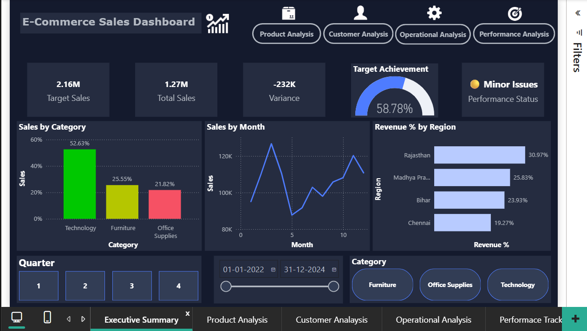
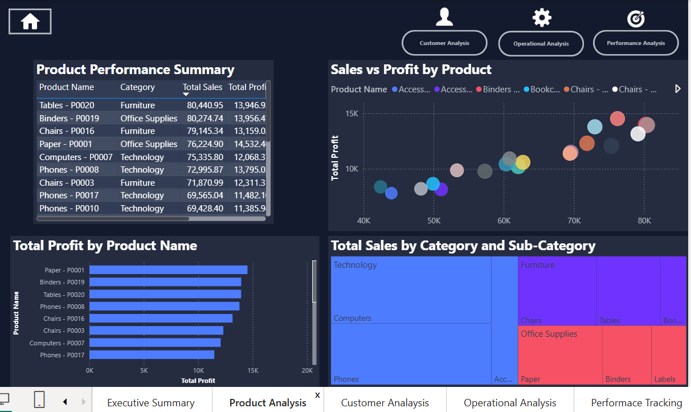
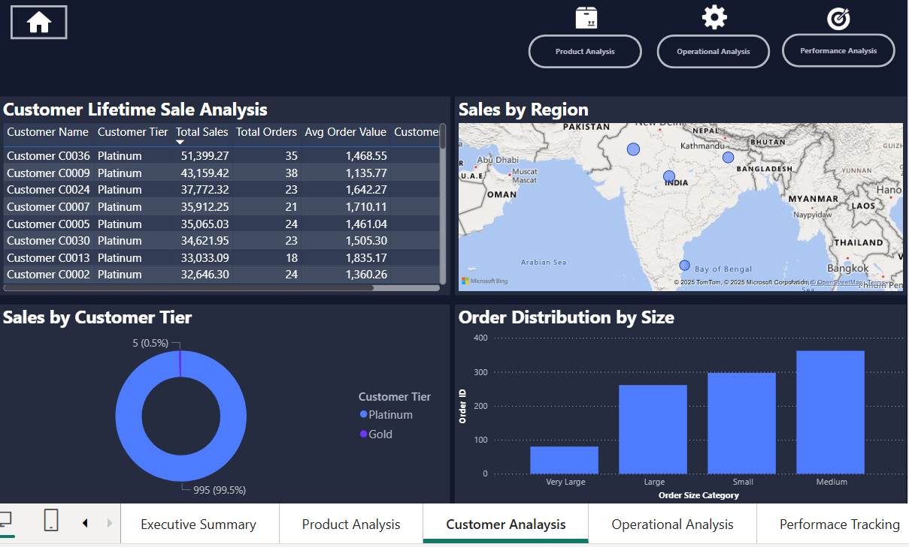
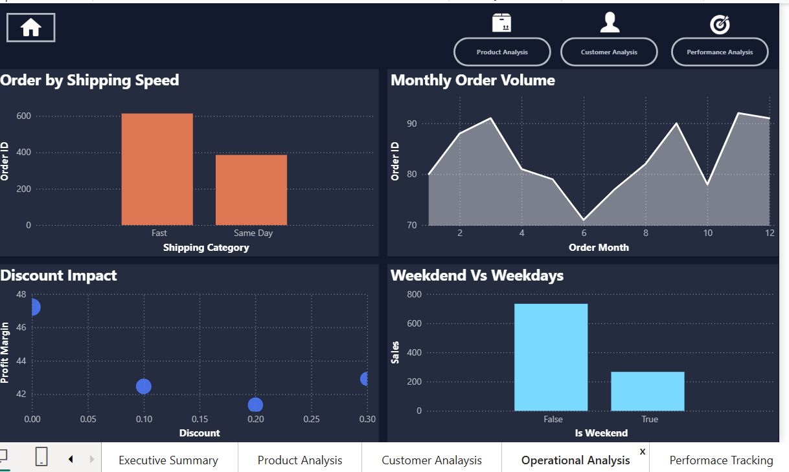

# Superstore E-Commerce Data Analysis

This project showcases an end-to-end retail analytics workflow :
Messy Excel ➡️ Python cleaning & EDA ➡️ Power BI modelling & DAX ➡️ interactive dashboard. 
Objective: discover why FY-24 sales (USD 1.27 M) trail the 2.16 M target and propose data-backed actions.

---
## 1  Project Roadmap
- **Data**   `messy_superstore_dataset.xlsx` (6 sheets, 9 K order lines).
- **Stack**  Python (pandas, seaborn, matplotlib) · Power BI · Excel.
- **Workflow**  
  1. Ingest & clean raw Excel in Python, Performed detailed EDA.  
  2. Data validation (outliers, nulls, negative profits).  
  3. Feature engineering – Revenue, Cost, Profit-Margin, Shipping-Days, Order-Size-Category.  
  4. Export tidy dataset → Power BI for star-schema modelling & DAX KPIs.  
  5. Publish interactive dashboard & share insights.

---

## 2  Business Questions & Answers

| # | Question | Insight |
|---|-----------|---------|
| 1 | How much revenue does each region generate? | Maharashtra 31 %, Madhya Pradesh 26 %, Bihar 24 %, Chennai 19 % |
| 2 | Which product categories drive sales? | Technology 53 %, Furniture 26 %, Office Supplies 22 % |
| 3 | Are discounts eroding profit? | Profit-margin drops from 15 % → 9 % when discount > 20 % |
| 4 | Do shipping times impact profit? | Fast shipping: 600 orders, Same-Day: 400; margin difference < 1 pp |
| 5 | Month-over-month revenue trend? | Peak 120 k in May → dip 80 k in Jun (FY-24) |

---
## 3  Key Findings & Action Plan

- Maharashtra + Madhya Pradesh ≈ 57 % of profit – replicate their playbook in lagging regions.
- Technology (Computers & Phones) = one-third of revenue – double inventory & promo budgets.
- Heavy discounts hurt margin more than they lift volume – cap routine promos at 20 %.
- Furniture under-indexes in Bihar & Chennai – launch bundled offers and localized ads.
- Embed Sales-vs-Target KPI in quarterly bonus calculations to accelerate accountability.

---
## 4  Visualization
Check out the interactive dashboard highlights:

A 5-page Power BI report

---
## 5  Requirements

Core libraries:
- pandas · numpy · matplotlib · seaborn
- jupyterlab · openpyxl 

---

## 6 📩 Connect With Me
- [LinkedIn](https://www.linkedin.com/in/mayank-bisht-322051234/)
- [Email](mayankbisht9891@gmail.com)
- #DataAnalytics #BusinessAnalyst #Portfolio
